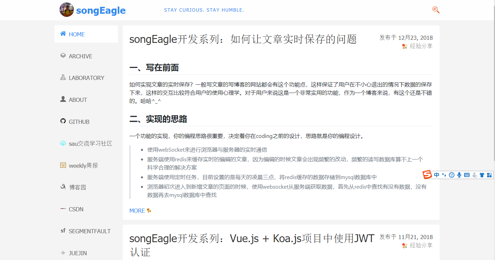
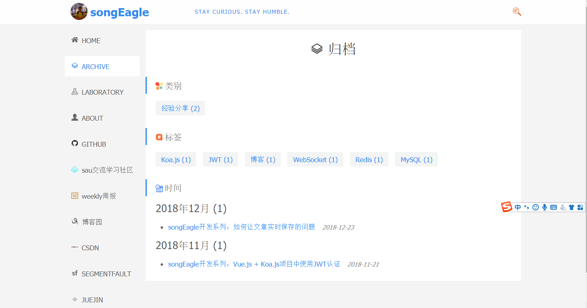
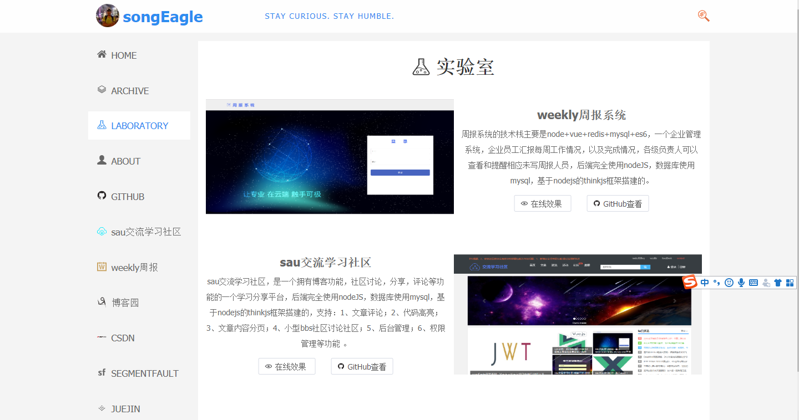
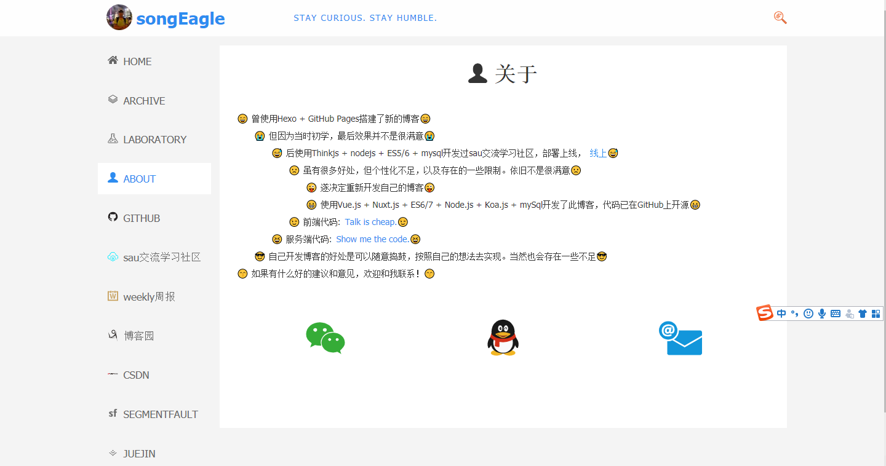
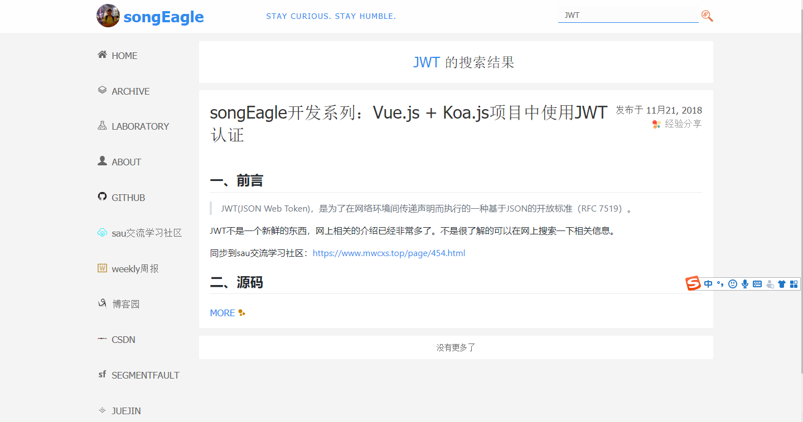
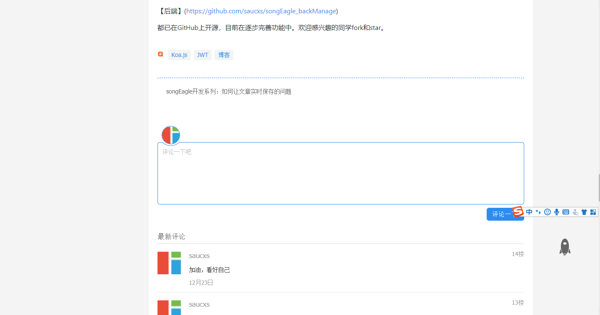

# songEagle
songEagle是自己一个小窝，自己写文章的小窝。文章内容不限于技术，可以是经验分享，项目实战，实验室，资讯，一些想法，一些感慨。

## 技术栈
nuxtjs + vuejs + koajs + websocket + redis + mysql

### 目录结构
+ .nuxt    —— bulid编译后文件夹，nuxt使用服务端渲染
+ assets    ——资源文件
+ components   —— 组件文件夹
+ dist    —— generate编译后文件夹，nust使用vue单页面模式spa
+ layouts   —— 页面布局文件夹
+ middleware   —— 中间件文件夹
+ node_modules   —— 各种npm包
+ pages   —— 路由文件夹
+ plugins   —— 插件
+ static   —— 静态文件
+ store   —— vuex文件夹
+ nuxt.config.js   —— nuxt个性化配置文件

### 功能特点
> 1、home主页
> 2、archive归档
> 3、laboratory实验室
> 4、about关于
> 5、搜索
> 6、文章评论
...

### 版本功能
+ 1、home主页
+ 2、archive归档
+ 3、laboratory实验室
+ 4、about关于
+ 5、搜索
+ 6、文章评论
+ 待续
    - 各个模块数据埋点
    
### 截图
1、home主页


2、archive归档


3、laboratory实验室


4、about关于


5、search搜索


6、comment评论


7、无线端


### 运行
```
git clone 

```
